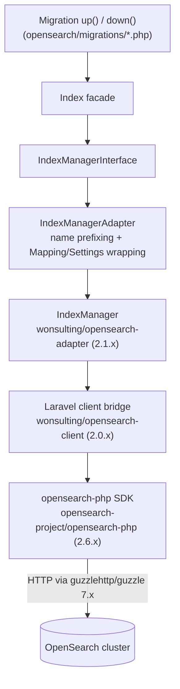

# Architecture

Internal architecture reference for **`wonsulting/opensearch-migrations`**. This document
explains *how the package is built*; for *how to use it* (the migration authoring API, the
Artisan commands, configuration options) see the [README](../README.md). New maintainers
should read this alongside the [operational runbook](runbook.md).

## Contents

- [Purpose & scope](#purpose--scope)
- [Layer diagram](#layer-diagram)
- [Directory map](#directory-map)
- [Class-by-class reference](#class-by-class-reference)
- [DI & bootstrap flow](#di--bootstrap-flow)
- [Migration lifecycle](#migration-lifecycle)
- [Index & alias prefix semantics](#index--alias-prefix-semantics)
- [`connection()` switching](#connection-switching)
- [Configuration schema](#configuration-schema)
- [Known inconsistencies](#known-inconsistencies)

---

## Purpose & scope

OpenSearch Migrations lets a Laravel application **version and share OpenSearch index
schemas** across environments the same way Laravel's database migrations version a relational
schema. Migration authors write small classes with `up()` / `down()` methods that create,
update, or drop indices and aliases through a fluent `Index` facade; the package records which
migrations ran (in a relational tracking table) and provides Artisan commands to apply, roll
back, refresh, or inspect them.

The package is **orchestration + a thin adapter**. It does not talk to OpenSearch directly —
it delegates every index operation to `wonsulting/opensearch-adapter`, which in turn sits on
top of `wonsulting/opensearch-client` and the official `opensearch-project/opensearch-php`
SDK.

## Layer diagram

A call from a migration flows down through these layers to the cluster:



Plain-text layer list (top = what a migration author touches, bottom = the cluster):

1. **Migration class** — `up()` / `down()`, implements `OpenSearch\Migrations\MigrationInterface`.
2. **`Index` facade** — `OpenSearch\Migrations\Facades\Index`; the API used inside migrations.
3. **`IndexManagerInterface`** — `OpenSearch\Migrations\IndexManagerInterface`; the bound contract.
4. **`IndexManagerAdapter`** — `OpenSearch\Migrations\Adapters\IndexManagerAdapter`; applies
   index/alias name prefixing and wraps closures in `Mapping` / `Settings` value objects.
5. **`OpenSearch\Adapter\Indices\IndexManager`** — from `wonsulting/opensearch-adapter`; the
   real index-management operations and the `Index` / `Mapping` / `Settings` value objects.
6. **`wonsulting/opensearch-client`** — the Laravel bridge
   (`OpenSearch\Laravel\Client\ServiceProvider`) that builds and binds the OpenSearch client
   and owns `config/opensearch.client.php` (connection host list, auth). Named connections
   used by `Index::connection('…')` are defined here.
7. **`opensearch-project/opensearch-php`** — the raw `OpenSearch\Client` SDK, over Guzzle HTTP.

> The **direct** composer requirement is `wonsulting/opensearch-adapter ^2.0`
> (`composer.json`). The client and the PHP SDK are pulled in transitively beneath it — the
> versions above (`2.1.1` / `2.0.1` / `2.6.0`) are what resolve today. See
> [Known inconsistencies](#known-inconsistencies) regarding the README wording.

## Directory map

```
.
├── config/
│   └── opensearch.migrations.php          # published package config
├── database/
│   └── migrations/
│       └── 2019_15_12_112000_create_opensearch_migrations_table.php   # relational tracking table
├── src/
│   ├── ServiceProvider.php                # bindings, config publish, command + migration registration
│   ├── Migrator.php                        # orchestration core
│   ├── helpers.php                         # prefix_index_name(), prefix_alias_name()
│   ├── IndexManagerInterface.php           # interface
│   ├── MigrationInterface.php              # interface (up()/down())
│   ├── ReadinessInterface.php              # interface (isReady())
│   ├── Adapters/
│   │   └── IndexManagerAdapter.php
│   ├── Console/
│   │   ├── MakeCommand.php  MigrateCommand.php  RollbackCommand.php
│   │   ├── ResetCommand.php  RefreshCommand.php  FreshCommand.php  StatusCommand.php
│   │   └── stubs/migration.blank.stub      # template for generated migrations
│   ├── Facades/Index.php
│   ├── Factories/MigrationFactory.php
│   ├── Filesystem/MigrationStorage.php  Filesystem/MigrationFile.php
│   └── Repositories/MigrationRepository.php
└── tests/
    ├── Unit/Filesystem/MigrationFileTest.php
    ├── Integration/…                        # one test per class above
    └── migrations/                          # fixture migrations used by tests
```

PSR-4 root: `OpenSearch\Migrations\` → `src` (plus `src/helpers.php` autoloaded via composer
`files`), from `composer.json`.

## Class-by-class reference

Each entry lists the file, namespace, responsibility, and the methods that matter.

### `Migrator` — `src/Migrator.php`

The orchestration core; implements `ReadinessInterface`. Constructor-injects
`MigrationRepository`, `MigrationStorage`, and `MigrationFactory`, and holds an
`Illuminate\Console\OutputStyle` supplied by each command via `setOutput()`.

- `migrateOne(string $fileName)` / `migrateAll()` — resolve the pending file(s) and run them.
- `rollbackOne(string $fileName)` / `rollbackLastBatch()` / `rollbackAll()` — run `down()` on
  recorded migrations.
- `showStatus()` — renders the `Ran? / Last batch? / Migration` table.
- `isReady()` — true only when **both** the tracking table exists (`MigrationRepository`) and
  the storage path exists (`MigrationStorage`).
- private `migrate(Collection $files)` — computes `nextBatchNumber = lastBatchNumber() + 1`,
  then per file: `factory->makeFromFile()->up()` and `repository->insert(name, batch)`. **All
  files in one command invocation share one batch number.**
- private `rollback(Collection $fileNames)` — resolves names → files, aborts if any file is
  missing, else per file: `makeFromFile()->down()` and `repository->delete(name)`.

`Migrator` is **not** explicitly bound in the container — it is auto-wired when a command
type-hints it.

### `IndexManagerAdapter` — `src/Adapters/IndexManagerAdapter.php`

`namespace OpenSearch\Migrations\Adapters`; implements `IndexManagerInterface`. Wraps a
constructor-injected `OpenSearch\Adapter\Indices\IndexManager`. Two jobs: (a) prefix every
index/alias name via the `helpers.php` functions before delegating, and (b) offer a
migration-friendly fluent API. Every method returns `$this` for chaining.

- `create` / `createRaw` / `createIfNotExists` / `createIfNotExistsRaw` — build an `Index` from
  a `Mapping`/`Settings` closure (or raw arrays); the `IfNotExists` variants guard on
  `exists()`.
- `putMapping` / `putMappingRaw`, `putSettings` / `putSettingsRaw` — same closure-or-raw pattern.
- `pushSettings` / `pushSettingsRaw` — **close → apply settings → open** the index (required for
  static/analysis settings that cannot change on an open index).
- `drop` / `dropIfExists`.
- `putAlias` / `deleteAlias` — prefix both the index and alias names, then delegate.
- `connection(string $connection)` — clones the adapter and swaps the underlying `IndexManager`
  for one bound to the named connection (immutable; see [`connection()` switching](#connection-switching)).

> `putAlias` / `deleteAlias` are implemented here and documented on the facade, but are **not**
> declared on `IndexManagerInterface` — see [Known inconsistencies](#known-inconsistencies).

### `MigrationRepository` — `src/Repositories/MigrationRepository.php`

Implements `ReadinessInterface`. Tracks migration state in a **relational** table (not in
OpenSearch), reading the table name and DB connection from config in its constructor.

- `insert(name, batch)`, `exists(name)`, `delete(name)`, `purge()` (delete all rows).
- `lastBatchNumber(): ?int` — max `batch` value.
- `lastBatch(): Collection` — migration names in the highest batch (ordered `migration desc`).
- `all(): Collection` — all migration names (ordered `migration desc`).
- `isReady(): bool` — `Schema::connection($connection)->hasTable($table)`.

The table is defined by `database/migrations/2019_15_12_112000_create_opensearch_migrations_table.php`
(`CreateOpenSearchMigrationsTable`): two columns only — `migration` (string), `batch` (integer)
— no timestamps, no primary key. It is registered via the service provider's
`loadMigrationsFrom()`, so a normal `php artisan migrate` creates it (there is no separate
install command).

### `MigrationStorage` + `MigrationFile` — `src/Filesystem/`

`MigrationStorage` (registered as a **singleton**; implements `ReadinessInterface`) discovers
and creates on-disk migration files with `Illuminate\Filesystem\Filesystem`. Its `paths`
collection is seeded with `storage.default_path` from config.

- `create(name, content): MigrationFile` — writes to a full path if `name` contains a directory
  separator, else creates the default dir (`0755`) and writes `<defaultPath>/<name>.php`.
- `whereName(name): ?MigrationFile` — full-path aware; otherwise searches each registered path.
- `all(): Collection` — globs `*_*.php` across all paths, keyed by name, sorted ascending
  (chronological by the `Y_m_d_His` filename prefix).
- `registerPaths(array): self` — merge additional discovery paths (this is why it is a
  singleton — extra paths must persist).
- `isReady(): bool` — whether the default path directory exists.

`MigrationFile` is a value object around a path: `name()` (basename without `.php`), `path()`,
and `FILE_EXTENSION = '.php'`.

### `MigrationFactory` — `src/Factories/MigrationFactory.php`

`makeFromFile(MigrationFile $file): MigrationInterface`:

1. `require_once $file->path()`.
2. Derive the class name by dropping the first 4 underscore-separated segments (the
   `Y_m_d_His` timestamp) and `Str::studly()`-ing the rest — e.g.
   `2019_08_10_142230_update_test_index_mapping` → `UpdateTestIndexMapping`.
3. `resolve($className)` through the Laravel container — so **migration constructors support
   dependency injection** (e.g. inject `OpenSearch\Client` directly).

### `Index` facade — `src/Facades/Index.php`

`getFacadeAccessor()` returns `IndexManagerInterface::class`, so `Index::…` resolves the bound
`IndexManagerAdapter`. This is the primary API migration authors use inside `up()` / `down()`.
Its docblock advertises the full fluent surface (see the README's
[Writing Migrations](../README.md#writing-migrations) section for usage examples).

### The 7 console commands — `src/Console/`

Shared pattern (except `MakeCommand`): `$migrator->setOutput($this->output)` →
`confirmToProceed()` (`Illuminate\Console\ConfirmableTrait` + `--force` production guard) →
`$migrator->isReady()` → delegate to the `Migrator`.

| Command class     | Signature                                          | Behavior |
|-------------------|----------------------------------------------------|----------|
| `MakeCommand`     | `opensearch:make:migration {name}`                 | Renders `stubs/migration.blank.stub` (snake-cases the name, studly-cases the class, prefixes a `Y_m_d_His` timestamp) and writes it via `MigrationStorage::create()`. Does **not** use the migrator or `isReady()`. |
| `MigrateCommand`  | `opensearch:migrate {name?} {--force}`             | `migrateOne(name)` if a name is given, else `migrateAll()`. |
| `RollbackCommand` | `opensearch:migrate:rollback {name?} {--force}`    | `rollbackOne(name)` if a name is given, else `rollbackLastBatch()`. |
| `ResetCommand`    | `opensearch:migrate:reset {--force}`               | `rollbackAll()`. |
| `RefreshCommand`  | `opensearch:migrate:refresh {--force}`             | `rollbackAll()` then `migrateAll()`. |
| `FreshCommand`    | `opensearch:migrate:fresh {--force}`               | `Index::drop('*')` (drop **all** indices) → `repository->purge()` → `migrateAll()`. |
| `StatusCommand`   | `opensearch:migrate:status`                        | `showStatus()`. No `--force`, no confirmation. |

### The 3 interfaces — `src/`

- **`IndexManagerInterface`** (`src/IndexManagerInterface.php`) — the index-management contract
  bound to `IndexManagerAdapter` and used as the facade accessor. Declares (all returning
  `self`): `create`, `createRaw`, `createIfNotExists`, `createIfNotExistsRaw`, `putMapping`,
  `putMappingRaw`, `putSettings`, `putSettingsRaw`, `pushSettings`, `pushSettingsRaw`, `drop`,
  `dropIfExists`, `connection`.
- **`MigrationInterface`** (`src/MigrationInterface.php`) — `up(): void` and `down(): void`.
  Every user migration (and the blank stub) implements it.
- **`ReadinessInterface`** (`src/ReadinessInterface.php`) — a single `isReady(): bool`.
  Implemented by `Migrator`, `MigrationRepository`, and `MigrationStorage` for pre-flight
  checks.

### `helpers.php` — `src/helpers.php`

Autoloaded via composer `files`. Two functions, both used by `IndexManagerAdapter`:

- `prefix_index_name(string $indexName): string` — prepends `config('opensearch.migrations.prefixes.index')`.
- `prefix_alias_name(string $aliasName): string` — prepends `config('opensearch.migrations.prefixes.alias')`.

## DI & bootstrap flow

`OpenSearch\Migrations\ServiceProvider` (`src/ServiceProvider.php`, `final`) is registered via
Laravel package auto-discovery (`composer.json` → `extra.laravel.providers`). Its constructor
resolves the config and migration paths from the package root using `dirname(__DIR__)`, so they
work regardless of install location.

**`register()`**

- `mergeConfigFrom($configPath, 'opensearch.migrations')` — merge packaged defaults under the
  `opensearch.migrations` config key.
- `singletonIf(MigrationStorage::class)` — one shared storage instance so `registerPaths()`
  additions survive.
- `bindIf(IndexManagerInterface::class, IndexManagerAdapter::class)` — bind the interface (and
  therefore the `Index` facade) to the adapter.

  `bindIf` / `singletonIf` let a host application override either binding.

**`boot()`**

- `publishes([$configPath => config_path('opensearch.migrations.php')])` — makes the config
  publishable via `vendor:publish`.
- `loadMigrationsFrom($migrationsPath)` — registers the tracking-table migration so
  `php artisan migrate` creates `opensearch_migrations`.
- `commands([...7])` — registers the seven Artisan commands.

`Migrator`, `MigrationRepository`, and `MigrationFactory` are **not** explicitly bound; Laravel
auto-wires them (and their dependencies) when a command's `handle()` type-hints them.

## Migration lifecycle

```
make ──► migrate ──► status ──► rollback / reset / refresh / fresh
```

1. **`make`** renders `src/Console/stubs/migration.blank.stub` (a `final class DummyClass
   implements MigrationInterface` with empty `up()` / `down()`), replacing `DummyClass` with the
   studly class name, and writes `Y_m_d_His_<snake_name>.php` into the default storage path.
2. **`migrate`** = `storage->all()` minus `repository->all()` (the pending set) → for each,
   `factory->makeFromFile()` (`require` + container `resolve`) → `up()` →
   `repository->insert(name, lastBatchNumber + 1)`. One command = one batch.
3. **`status`** diffs on-disk files against recorded rows: `Ran?` = present in `repository->all()`,
   `Last batch?` = present in `repository->lastBatch()`.
4. **`rollback`/`reset`/`refresh`** run `down()` on recorded migrations and `delete` their rows
   (`refresh` then re-migrates). **`fresh`** additionally drops **all** OpenSearch indices
   (`Index::drop('*')`) and `purge()`s the table before re-migrating.

Ordering is by the timestamped filename; identity is the file name; batch grouping enables
"roll back the last batch."

## Index & alias prefix semantics

`prefix_index_name()` / `prefix_alias_name()` **concatenate** the configured prefix with the
name — no separator is inserted, so any `_` / `-` must be part of the prefix value itself.
`IndexManagerAdapter` applies them to every index (and, for alias operations, alias) name, so
migration authors always pass **unprefixed** logical names while the real OpenSearch names are
`<prefix><name>`.

The prefix resolves through a fallback chain (`config/opensearch.migrations.php`):

```php
'index' => env('OPENSEARCH_MIGRATIONS_INDEX_PREFIX', env('SCOUT_PREFIX', '')),
'alias' => env('OPENSEARCH_MIGRATIONS_ALIAS_PREFIX', env('SCOUT_PREFIX', '')),
```

For the index prefix (alias is identical with its own var):

1. `OPENSEARCH_MIGRATIONS_INDEX_PREFIX` if set, else
2. `SCOUT_PREFIX` (Laravel Scout's global prefix) if set, else
3. `''` (no prefix).

The **`SCOUT_PREFIX` fallback** lets the package's index/alias names automatically match indices
that Laravel Scout already prefixes, without configuring the prefix twice. Index and alias
prefixes are resolved independently but default to the same `SCOUT_PREFIX`.

## `connection()` switching

There are **two independent** "connection" concepts:

**A — OpenSearch connection (the index side).** `IndexManagerInterface::connection()` is
implemented in `IndexManagerAdapter::connection()`:

```php
public function connection(string $connection): IndexManagerInterface
{
    $self = clone $this;
    $self->indexManager = $self->indexManager->connection($connection);
    return $self;
}
```

It **clones** the adapter (the shared singleton is never mutated) and swaps in an
`IndexManager` bound to the named connection. Migrations use it as
`Index::connection('secondary')->create(...)`. Connection names come from
`config/opensearch.client.php` (owned by `wonsulting/opensearch-client`).

**B — relational DB connection (the tracking-table side).** Entirely separate.
`MigrationRepository` reads `opensearch.migrations.database.connection` and uses
`DB::connection($connection)` / `Schema::connection($connection)` for all tracking-table I/O
(`null` = Laravel's default DB connection). The tracking-table migration is a normal Laravel
migration, so it runs on whatever connection `php artisan migrate` targets.

## Configuration schema

Published to `config/opensearch.migrations.php` (`vendor:publish --provider="OpenSearch\Migrations\ServiceProvider"`).

| Key                    | Env var                                                   | Default                              | Purpose |
|------------------------|-----------------------------------------------------------|--------------------------------------|---------|
| `storage.default_path` | `OPENSEARCH_MIGRATIONS_DEFAULT_PATH`                      | `base_path('opensearch/migrations')` | Directory where migration files are created and scanned (`MigrationStorage`). |
| `database.table`       | `OPENSEARCH_MIGRATIONS_TABLE`                             | `opensearch_migrations`              | Relational tracking table (`migration`, `batch`). Read by `MigrationRepository` and `CreateOpenSearchMigrationsTable`. |
| `database.connection`  | `OPENSEARCH_MIGRATIONS_CONNECTION`                        | `null` (default connection)          | DB connection for all tracking-table reads/writes and the `hasTable` readiness check. |
| `prefixes.index`       | `OPENSEARCH_MIGRATIONS_INDEX_PREFIX` → `SCOUT_PREFIX`     | `''`                                 | String prepended to every index name. |
| `prefixes.alias`       | `OPENSEARCH_MIGRATIONS_ALIAS_PREFIX` → `SCOUT_PREFIX`     | `''`                                 | String prepended to every alias name. |

## Known inconsistencies

These are documented so maintainers are not surprised; they are candidates for the wider
modernization effort, not necessarily bugs.

1. **Dependency name in the README.** The README states the package depends on
   `wonsulting/opensearch-client`, but `composer.json` actually requires
   `wonsulting/opensearch-adapter ^2.0`. The client is a transitive dependency *beneath* the
   adapter. Both are real layers (see the [layer diagram](#layer-diagram)); the README wording
   just names the wrong direct dependency.
2. **PHP version range.** `composer.json` allows `php: ^7.4 || ^8.0` and CI tests PHP
   7.4 – 8.2, while the README and `CONTRIBUTING.md` state "PHP 8.2+". Treat 8.2+ as the
   supported target but be aware the constraint is broader. (See the runbook for the PHP-8.4
   static-analysis note.)
3. **`putAlias` / `deleteAlias` are off-contract.** They are implemented on
   `IndexManagerAdapter` and documented in the `Index` facade docblock, but are **not**
   declared on `IndexManagerInterface`. They work at runtime because the concrete adapter
   defines them, but they are not part of the typed contract, so an alternate
   `IndexManagerInterface` implementation would not be required to provide them.
